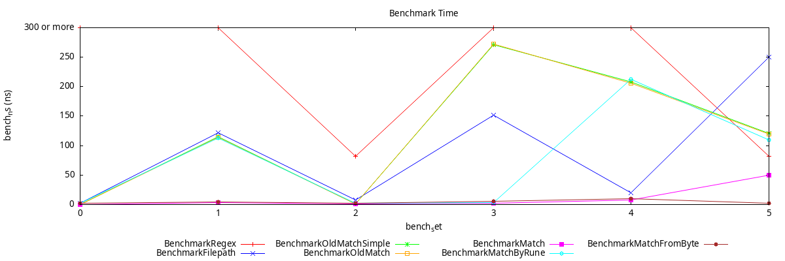
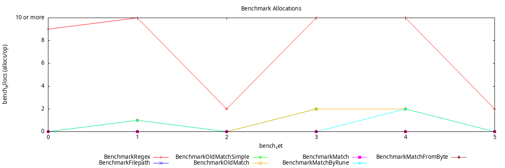

# Go-wildcard

[](https://goreportcard.com/report/github.com/IGLOU-EU/go-wildcard/v2)
[](https://pkg.go.dev/github.com/IGLOU-EU/go-wildcard/v2)
[](https://opensource.org/license/bsd-3-clause/)

## 💡 Why
The purpose of this library is to provide a simple and fast wildcard pattern matching.
Regex are much more complex and slower (even prepared regex)... and the filepath.Match is file-name-centric.

So, this library is a very fast and very simple alternative to regex and not tied to filename semantics unlike filepath.Match. 
There are no dependencies and is alocation free. 🥳

## 🧰 Features
There are the supported patterns operators:
- `*` match zero or more characters
- `?` match zero or one character
- `.` match exactly one character

## 🧐 How to
>⚠️ WARNING: Unlike the GNU "libc", this library have no equivalent to "FNM_FILE_NAME". 
>To do this you can use "path/filepath" https://pkg.go.dev/path/filepath#Match

There is super simple to use this library, you just have to import it and use the Match function.
```go
package main

import (
	"fmt"

	"github.com/IGLOU-EU/go-wildcard/v2"
)

func main() {
    str := "daaadabadmanda"
    pattern := "?a*da*d.?*"

    resultM := wildcard.Match(pattern, str) // Fastest way but can't use '?' or '." with rune multiple byte representation
    resultMFB = wildcard.MatchFromByte([]byte(pattern), []byte(str)) // Same as Match to avoid convertion (bad example here)
    resultMBR = wildcard.MatchByRune(pattern, str) // Slower than Match but with strict rune comparison (not grapheme cluster)

	fmt.Println(str, pattern, result)
}
```

## 🛸 Benchmark
The benchmark is done with the following command:
```bash
go test -benchmem -bench . github.com/IGLOU-EU/go-wildcard/v2/benchmark
```

```yml
goos: linux
goarch: amd64
pkg: github.com/IGLOU-EU/go-wildcard/v2
cpu: AMD Ryzen 7 PRO 6850U with Radeon Graphics  
```

The tested fonctions are:
- regexp.MatchString
- filepath.Match
- oldMatchSimple `From the commit a899be92514ed08aa5271bc3b93320b719ce2114`
- oldMatch `From the commit a899be92514ed08aa5271bc3b93320b719ce2114`
- Match `From string with byte comparison`
- MatchByRune `From string with rune comparison`
- MatchFromByte `From byte slice with byte comparison`




## 🕰 History 
Originally, this library was a fork from the Minio project.
The purpose was to give access to this "lib" under Apache license, without importing the entire Minio project.
And to keep it usable under the Apache License Version 2.0 after MinIO project is migrated to GNU Affero General Public License 3.0 or later from [`update license change for MinIO`](https://github.com/minio/minio/commit/069432566fcfac1f1053677cc925ddafd750730a)

The actual Minio wildcard matching code can be found in [`wildcard.go`](https://github.com/minio/pkg/tree/main/wildcard)